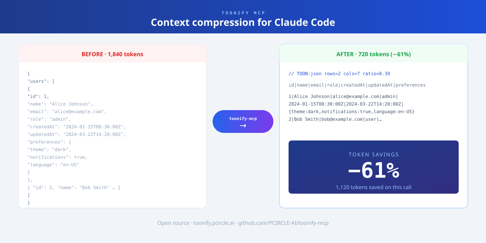

# Toonify MCP

**[English](README.md) | [繁體中文](README.zh-TW.md) | [日本語](README.ja.md) | [Español](README.es.md) | [Français](README.fr.md) | [Deutsch](README.de.md) | [한국어](README.ko.md) | [Русский](README.ru.md) | [Português](README.pt.md) | [Tiếng Việt](README.vi.md) | [Bahasa Indonesia](README.id.md)**



Context compression plugin for Claude Code. Automatically trims large tool output—JSON, YAML, stack traces, and logs—before it enters the context window.

Works as a Claude Code plugin (automatic, zero-config) or as an MCP server (on-demand).

## Features

- Compresses large JSON, YAML, and API responses
- Reduces long test failures and stack traces
- Runs automatically in the background—no change to your Claude Code workflow required

## Limitations

Skipped for short text, very small files, and content where exact original formatting must be preserved.

## Installation

```bash
git clone https://github.com/PCIRCLE-AI/toonify-mcp.git
cd toonify-mcp
npm install
npm run build
npm install -g .
toonify-mcp setup
toonify-mcp doctor
```

`toonify-mcp setup` adds the local marketplace and installs, updates, or re-enables the plugin automatically.

## Check status

```bash
toonify-mcp status
```

## MCP mode (optional)

```bash
toonify-mcp setup mcp
claude mcp list
```

`claude mcp list` should show `toonify: toonify-mcp - ✓ Connected`.

## Pipe filter (any agent CLI)

`toonify-mcp compress` reads stdin, compresses what's safe to compress (JSON/YAML → TOON, repetitive logs collapsed; source code, prose, and precision-sensitive numbers pass through untouched), and writes to stdout. It never breaks a pipe — when compression doesn't apply, the input comes out byte-for-byte.

```bash
curl -s https://api.example.com/users | toonify-mcp compress
```

This works with any agent CLI, because output is compressed *before* it enters the model's context. To have an agent adopt it, add a rule to your project's agent instructions (e.g. `AGENTS.md`):

```markdown
When a command is likely to print large JSON/YAML or long logs,
pipe it through `toonify-mcp compress` (e.g. `curl ... | toonify-mcp compress`).
It only rewrites output it can compress losslessly; everything else passes through.
```

## OpenAI Codex CLI (on-demand)

```bash
toonify-mcp setup codex
```

Registers toonify as an MCP server in `~/.codex/config.toml` (a timestamped backup of the file is made first). Codex can then call the `optimize_content` tool on demand.

Note: on Codex this is **on-demand, not automatic** — Codex's hooks cannot yet replace tool output the way Claude Code's `updatedToolOutput` does, and appending a compressed copy would grow context instead of shrinking it. For automatic compression on Codex, use the pipe filter above.

## Docs

- Site: https://toonify.pcircle.ai/
- Benchmarks: https://toonify.pcircle.ai/benchmarks.html
- Privacy: https://toonify.pcircle.ai/privacy.html
- Terms: https://toonify.pcircle.ai/terms.html
- [benchmarks.html](docs/benchmarks.html)
- [CHANGELOG.md](CHANGELOG.md)
- [CONTRIBUTORS.md](CONTRIBUTORS.md)
